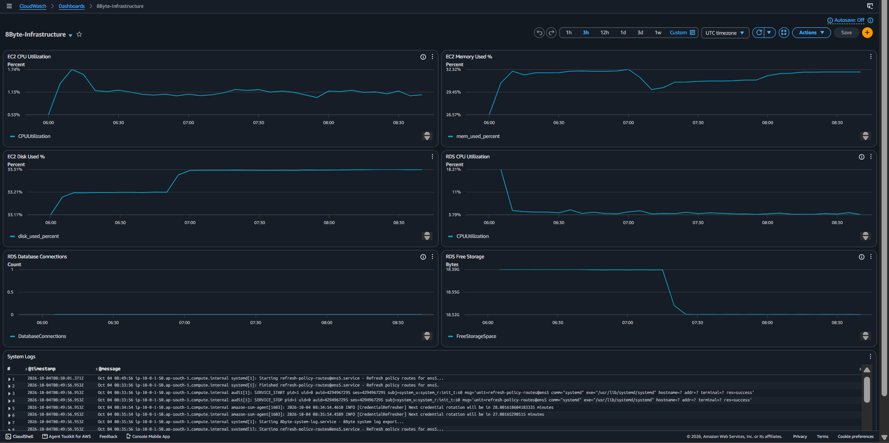
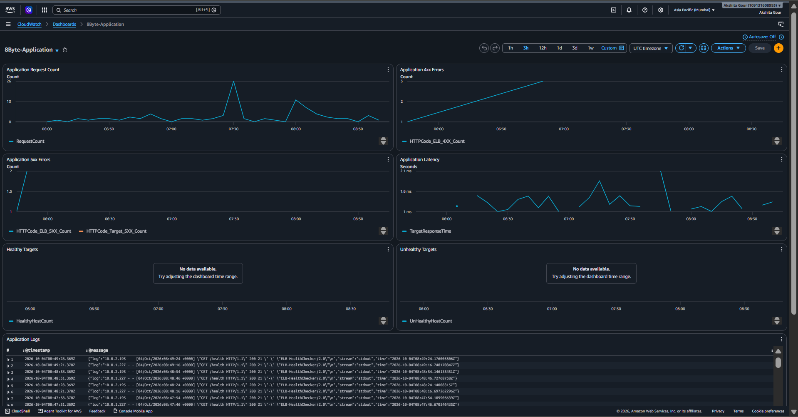
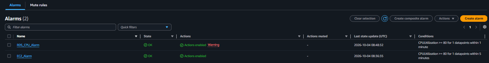

# 8Byte DevOps & DevSecOps Assignment

An end-to-end **DevOps and DevSecOps implementation on AWS** using Terraform, GitHub Actions, Docker, Amazon ECR, EC2, Application Load Balancer, RDS PostgreSQL, AWS Systems Manager, and CloudWatch.

The application is intentionally lightweight so the project focuses on the **infrastructure, CI/CD, security, deployment, monitoring, logging, and operational practices** expected in a DevOps/DevSecOps environment.

---

## 📌 Project Highlights

- Infrastructure as Code with **Terraform**
- AWS VPC with **public and private subnets**
- Dockerized Flask application running on **EC2**
- **Application Load Balancer** with health checks
- **RDS PostgreSQL** deployed in private subnets
- Docker images stored in **Amazon ECR**
- CI/CD using **GitHub Actions**
- Keyless AWS authentication using **GitHub OIDC**
- Remote deployment using **AWS Systems Manager**
- Automated unit and integration testing
- SAST, secret, dependency, code-quality, and container scanning
- **CloudWatch dashboards, centralized logging, and alarms**
- RDS automated backups
- Database credentials managed with **AWS Secrets Manager**
- Remote and encrypted Terraform state in **Amazon S3**

---

# 🏗️ Architecture

The solution is designed around a secure AWS architecture with a public-facing **Application Load Balancer**, a containerized application running on **EC2**, and a **PostgreSQL database** hosted in private subnets.

## 🖼️ AWS Architecture Diagram


---

## 📐 Application Flow

```text
Internet
   |
   v
Application Load Balancer
   |
   | HTTP : 5000
   v
EC2 + Docker + Gunicorn
   |
   | TCP : 5432
   v
RDS PostgreSQL
```

### Request Flow

1. Users access the application through the **Application Load Balancer**.
2. The ALB forwards application traffic to the **EC2 instance** on port `5000`.
3. The Flask application runs inside a **Docker container** using **Gunicorn**.
4. The application communicates with **RDS PostgreSQL** on TCP port `5432`.

---

## 🌐 AWS Network Layout

```text
AWS VPC - 10.0.0.0/16
│
├── Public Subnet 1 - 10.0.1.0/24
│   ├── Application Load Balancer
│   └── EC2 Application
│
├── Public Subnet 2 - 10.0.2.0/24
│   └── Application Load Balancer
│
├── Private Subnet 1 - 10.0.11.0/24
│   └── RDS PostgreSQL
│
└── Private Subnet 2 - 10.0.12.0/24
    └── RDS PostgreSQL
```

> 💰 **Cost Optimization:** A NAT Gateway was intentionally not used in this assignment environment to control cost.

---

# 🔄 CI/CD and Deployment Flow

The CI/CD pipeline automates **testing, security scanning, container image creation, image publishing, and deployment** to AWS.

---

## 🔄 Pipeline Flow

```text
Developer
   |
   v
GitHub
   |
   v
GitHub Actions
   |
   +--> Unit Tests
   +--> Integration Tests
   +--> Semgrep
   +--> Gitleaks
   +--> pip-audit
   +--> Snyk
   +--> SonarCloud
   +--> Trivy
   |
   v
Amazon ECR
   |
   v
AWS Systems Manager
   |
   v
EC2
   |
   v
Docker + Gunicorn
```

---

## 🚀 CI/CD Process

1. Code is pushed to **GitHub**.
2. **GitHub Actions** starts the CI/CD pipeline.
3. Automated testing and security checks are executed.
4. The Docker image is built and scanned.
5. The validated image is pushed to **Amazon ECR**.
6. **AWS Systems Manager** is used to deploy the image to EC2.
7. The application runs inside Docker using **Gunicorn**.

---

# ☁️ AWS Infrastructure

The following AWS infrastructure is provisioned for the assignment environment.

---

## 🌐 Infrastructure Configuration

| **Component** | **Configuration** |
|---|---|
| **AWS Region** | `ap-south-1` |
| **VPC CIDR** | `10.0.0.0/16` |
| **Public Subnets** | 2 |
| **Private Subnets** | 2 |
| **Internet Gateway** | Yes |
| **NAT Gateway** | No |
| **Compute** | EC2 `t3.micro` |
| **Load Balancer** | Application Load Balancer |
| **Database** | RDS PostgreSQL |
| **Container Registry** | Amazon ECR |
| **Remote Management** | AWS Systems Manager |
| **Monitoring** | Amazon CloudWatch |

---

## 🌐 Subnet Configuration

| **Subnet** | **CIDR** | **Purpose** |
|---|---|---|
| **Public Subnet 1** | `10.0.1.0/24` | ALB + EC2 |
| **Public Subnet 2** | `10.0.2.0/24` | ALB |
| **Private Subnet 1** | `10.0.11.0/24` | RDS |
| **Private Subnet 2** | `10.0.12.0/24` | RDS |

---

# 🔐 Network Security

Traffic is restricted using separate **Security Groups** following a least-privilege approach.

---

## 🔒 Security Group Architecture

```text
Internet
   |
   | HTTP / HTTPS : 80 / 443
   v
ALB Security Group
   |
   | HTTP : 5000
   v
EC2 Application Security Group
   |
   | TCP : 5432
   v
RDS Security Group
```

---

## 🔐 Security Group Rules

| **Source** | **Destination** | **Port** | **Purpose** |
|---|---|---:|---|
| Internet | ALB Security Group | `80/443` | Application traffic |
| ALB Security Group | EC2 Security Group | `5000` | Application traffic |
| EC2 Security Group | RDS Security Group | `5432` | PostgreSQL database traffic |

---

> 🔒 **Database Security:** The RDS instance is **not publicly accessible**.

---

# 🔑 Secure AWS Authentication

GitHub Actions authenticates to AWS using **OpenID Connect (OIDC)**.

---

## 🔐 Authentication Flow

```text
GitHub Actions
      |
      | OIDC
      v
AWS IAM Role
      |
      v
AWS Services
```

GitHub Actions uses OIDC to obtain temporary AWS credentials through an IAM role instead of storing long-lived AWS access keys in GitHub Secrets.

---

## 🛡️ Security Benefits

- No long-lived AWS access keys are stored in GitHub.
- Authentication is based on **OIDC**.
- AWS access is controlled through an **IAM Role**.
- Temporary credentials are used by the CI/CD workflow.
- IAM permissions can be restricted following the **least-privilege principle**.

---

## 🚀 EC2 Deployment

**AWS Systems Manager (SSM)** is used for EC2 deployment instead of traditional SSH-based deployment.

```text
GitHub Actions
      |
      | AWS IAM + OIDC
      v
AWS Systems Manager
      |
      | Run Command
      v
EC2 Instance
```

This approach removes the need for SSH-based deployment and allows GitHub Actions to execute deployment commands on the EC2 instance through **AWS Systems Manager**.

---

# 🐳 Containerization

The application is packaged as a **Docker image** and runs as a container on the EC2 instance.

---

## 🔒 Docker Security Characteristics

- Multi-stage Docker build
- Alpine-based runtime image
- Non-root application user
- Gunicorn production server
- Container vulnerability scanning
- Flask development server is not used in production

---

## ⚙️ Application Configuration

| **Configuration** | **Value** |
|---|---|
| **Container Platform** | Docker |
| **Runtime Image** | Alpine-based |
| **Application Server** | Gunicorn |
| **Application Port** | `5000` |
| **Application User** | Non-root |

---

## ❤️ Application Health Check

The application exposes a dedicated health endpoint:

```http
GET /health
```

---

## ✅ Expected Response

```json
{
  "status": "healthy"
}
```

---

The `/health` endpoint is used by the **Application Load Balancer target group** to determine the health of the application.

The ALB periodically sends health-check requests to this endpoint and uses the response to determine whether the EC2 application target is healthy.

---

# 📦 Amazon ECR

The container image is stored in **Amazon Elastic Container Registry (ECR)**.

---

## 🔄 Container Image Flow

```text id="8x2m1a"
GitHub Actions
      |
      v
Docker Build
      |
      v
Security Scans
      |
      v
Amazon ECR
      |
      v
AWS Systems Manager
      |
      v
EC2 Docker Container
```

---

## 🔐 ECR Usage

Amazon ECR provides a centralized **private container registry** for the application Docker image.

The CI/CD pipeline:

1. Builds the Docker image.
2. Runs security and vulnerability scans.
3. Pushes the validated image to **Amazon ECR**.
4. Uses **AWS Systems Manager** to deploy the image to EC2.
5. EC2 pulls the image from ECR and runs it as a Docker container.

---

## 🛡️ Security

ECR access is controlled using **AWS IAM permissions**.

The deployment process does not require Docker images to be stored directly in the EC2 filesystem or source repository.

---

# 🖥️ Application Deployment

Deployment is performed through **AWS Systems Manager (SSM)**.

---

## 🚀 Deployment Flow

```text id="7m5zq4"
GitHub Actions
      |
      v
Amazon ECR
      |
      v
AWS Systems Manager
      |
      v
EC2
      |
      v
Docker
      |
      v
Gunicorn
```

---

## 🔄 Deployment Process

1. GitHub Actions authenticates to AWS using **OIDC**.
2. The Docker image is built and pushed to **Amazon ECR**.
3. AWS Systems Manager sends the deployment command to the EC2 instance.
4. EC2 retrieves the required Docker image from ECR.
5. Docker starts the application container.
6. **Gunicorn** serves the Flask application.
7. The application is exposed through the **Application Load Balancer**.

---

## ❤️ Application Health Check

The ALB target group performs health checks against:

```http
GET /health
```

The health endpoint is used to verify that the application running on EC2 is available and responding correctly.

---

# 🧪 CI/CD Security & Quality Checks

The GitHub Actions pipeline integrates multiple **security and quality controls** to validate application code, dependencies, secrets, and container images before deployment.

---

## 🔍 Security & Quality Tools

| **Category** | **Tool** |
|---|---|
| **Unit Testing** | `pytest` |
| **Integration Testing** | Docker + HTTP health check |
| **SAST** | Semgrep |
| **Secret Scanning** | Gitleaks |
| **Python Dependency Audit** | pip-audit |
| **Dependency Security** | Snyk |
| **Code Quality** | SonarCloud |
| **Container Scanning** | Trivy + Snyk |

---

## 🔄 Pull Request Validation

```text id="3k8v2p"
Pull Request
      |
      +--> Unit Tests
      |
      +--> Integration Tests
      |
      +--> Semgrep
      |
      +--> Gitleaks
      |
      +--> pip-audit
      |
      +--> Snyk
      |
      +--> SonarCloud
      |
      +--> Trivy
      |
      v
Validation Complete
```

---

## 🛡️ Security Validation

The pipeline ensures that code and dependencies are checked before changes are promoted through the deployment pipeline.

The checks cover:

- Application functionality
- Integration behavior
- Source-code security
- Secret exposure
- Python dependency vulnerabilities
- Dependency security
- Code quality
- Container vulnerabilities

---

# 📊 Monitoring & Observability

Monitoring and observability are implemented using **Amazon CloudWatch**.

Two dashboards are configured for the environment:

1. **8Byte-Infrastructure**
2. **8Byte-Application**

---

## 1️⃣ 8Byte-Infrastructure Dashboard

The infrastructure dashboard monitors:

- EC2 CPU utilization
- EC2 memory utilization
- EC2 disk utilization
- RDS CPU utilization
- RDS database connections
- RDS free storage
- System logs

### 📸 Infrastructure Dashboard



---

## 2️⃣ 8Byte-Application Dashboard

The application dashboard monitors:

- Application request count
- HTTP 4xx errors
- HTTP 5xx errors
- Application latency
- Healthy targets
- Unhealthy targets
- Application logs
- ALB access logs

### 📸 Application Dashboard



---

# 🚨 CloudWatch Alarms

CloudWatch alarms provide baseline operational alerting.

### 📸 Alarm Evidence


# 📝 Centralized Logging

Application, system, and **Application Load Balancer (ALB)** logs are centralized using **Amazon CloudWatch Logs**.

---

## 📦 Application Logs

```text
/8byte-devops/application
```

Application logs include:

- Docker output
- Gunicorn output
- Application traffic
- ALB health-check activity

---

## 🖥️ System Logs

```text
/8byte-devops/system
```

System logs include host-level events such as:

- `systemd`
- AWS Systems Manager
- Audit-related events

---

## 🌐 ALB Access Logs

```text
/aws/vendedlogs/elasticloadbalancing/loadbalancer/ALB_ACCESS_LOGS/app
```

ALB access logs provide request-level information such as:

- Request line
- User agent
- Request source
- Request timing
- Load balancer traffic information

---

## 🔎 Log Monitoring

CloudWatch Logs provides centralized storage and allows the logs to be queried and analyzed using **CloudWatch Logs Insights**.

---

# 🗄️ RDS PostgreSQL

RDS PostgreSQL is deployed in the **private subnets** and is accessible only from the application running on EC2.

---

## 🔄 Database Connectivity

```text id="n2k6v8"
EC2 Application
      |
      | TCP : 5432
      v
RDS PostgreSQL
```

---

## 🔐 Database Protection

- Private subnet placement
- Security-group restricted access
- Encrypted storage
- Automated backups
- Credentials managed through **AWS Secrets Manager**

---

## 💾 Automated Backups

**Automated backup retention:** `1 day`

The database backup configuration provides basic recovery capability for the assignment environment.

---

# 🔐 Secrets Management

Database credentials are managed using **AWS Secrets Manager**.

---

## 🔄 Secret Management Flow

```text id="q8z4rm"
Terraform
    |
    v
AWS Secrets Manager
    |
    v
Database Credentials
```

---

## 🛡️ Security

Database credentials are not intended to be stored directly in source control.

Using **AWS Secrets Manager** provides centralized management of sensitive database credentials while keeping them separate from application source code and configuration files.

---

# 🏗️ Terraform Infrastructure

Terraform is used as the **Infrastructure as Code (IaC)** solution for provisioning and managing the AWS environment.

---

## 📁 Terraform Structure

```text
terraform/
│
├── backend.tf
├── providers.tf
├── versions.tf
├── variables.tf
├── main.tf
├── outputs.tf
│
├── modules/
│   ├── alb/
│   ├── ec2/
│   ├── rds/
│   ├── security-groups/
│   └── vpc/
│
└── environments/
```

---

## 🧩 Terraform Modules

| **Module** | **Responsibility** |
|---|---|
| `vpc` | VPC and subnet networking |
| `security-groups` | ALB, application, and database security groups |
| `ec2` | EC2 instance and SSM access |
| `alb` | Application Load Balancer and target group |
| `rds` | PostgreSQL database |

---

## 🚀 Terraform Initialization

From the Terraform directory:

```bash
cd terraform
```

Initialize Terraform:

```bash
terraform init
```

Validate the configuration:

```bash
terraform validate
```

Review the infrastructure plan:

```bash
terraform plan
```

---

## 🗃️ Terraform State

Terraform state is stored remotely in **Amazon S3** with encryption and state locking.

This provides centralized state management for the infrastructure.

---

# 🧪 Application Testing

The application includes automated tests that can be executed locally before deployment.

---

## 📦 Install Dependencies

Navigate to the application directory:

```bash
cd app
```

Install the required Python dependencies:

```bash
python -m pip install -r requirements.txt
```

---

## ▶️ Run Tests

Run the test suite using `pytest`:

```bash
pytest -v
```

The test suite validates the application before it is promoted through the CI/CD pipeline.

---

## 🐳 Build Docker Image

From the repository root, build the application Docker image:

```bash
docker build -t 8byte-devops-app ./app
```

The command builds the Docker image using the `Dockerfile` located in the `app/` directory.

---

## ▶️ Run Locally

Run the Docker container locally and expose the application on port `5000`:

```bash
docker run --rm -p 5000:5000 8byte-devops-app
```

The application will be available locally on port `5000`.

---

## ❤️ Health Check

Check the application health endpoint:

```bash
curl http://localhost:5000/health
```

### Expected Response

```json
{
  "status": "healthy"
}
```

The `/health` endpoint can be used to verify that the application is running and responding correctly.

---

# 🛡️ Security Controls

The project implements security controls across the **AWS infrastructure, CI/CD pipeline, and container environment**.

---

## 🔐 AWS Security

- GitHub OIDC authentication
- IAM role-based permissions
- IMDSv2
- Private RDS deployment
- Restricted security groups
- Encrypted Terraform state
- Encrypted RDS storage
- AWS Systems Manager for remote management and deployment

---

## 🔒 CI/CD Security

- **Semgrep** — Static Application Security Testing (SAST)
- **Gitleaks** — Secret detection
- **pip-audit** — Python dependency vulnerability scanning
- **Snyk** — Dependency and security scanning
- **SonarCloud** — Code quality and security analysis
- **Trivy** — Container vulnerability scanning

---

## 🐳 Container Security

- Non-root application user
- Multi-stage Docker build
- Minimal Alpine runtime image
- Gunicorn production server
- Container vulnerability scanning

---

# 💰 Cost Optimization

The assignment environment intentionally avoids unnecessary AWS costs while maintaining the required functionality.

---

## 💡 Key Decisions

- `t3.micro` EC2 instance
- Small RDS instance
- No NAT Gateway
- Limited monitoring scope
- Assignment-sized infrastructure
- Resources can be stopped when not required

---

> ⚠️ **Production Consideration:** For production environments, instance sizing, high availability, NAT requirements, monitoring retention, backups, and alerting thresholds should be reviewed against actual workload requirements.

---

# 📁 Repository Structure

```text id="q7m4ka"
8byte-devops-assignment/
│
├── .github/
│   └── workflows/
│       └── ci.yml
│
├── app/
│   ├── app.py
│   ├── requirements.txt
│   ├── Dockerfile
│   └── tests/
│       └── test_app.py
│
├── terraform/
│   ├── backend.tf
│   ├── providers.tf
│   ├── versions.tf
│   ├── variables.tf
│   ├── main.tf
│   ├── outputs.tf
│   │
│   ├── modules/
│   │   ├── alb/
│   │   ├── ec2/
│   │   ├── rds/
│   │   ├── security-groups/
│   │   └── vpc/
│   │
│   └── environments/
│
├── docs/
│   ├── approach.md
│   ├── challenges.md
│   └── screenshots/
│       ├── application-dashboard.png
│       ├── infrastructure-dashboard.png
│       └── cloudwatch-alarms.png
│
├── architecture/
│   └── 8byte-architecture-diagram.png
│
└── README.md
```

---

# 📚 Documentation

Additional project documentation is available in the `docs/` directory.

| **Document** | **Description** |
|---|---|
| [Implementation Approach](docs/approach.md) | Implementation approach |
| [Challenges & Resolutions](docs/challenges.md) | Challenges and resolutions |
| [AWS Architecture Diagram](../architecture/8byte-architecture-diagram.png) | AWS architecture diagram |

---

# 🎯 Assignment Coverage

The following table maps the assignment requirements to their corresponding implementation in the project.

---

## 📋 Requirement Mapping

| **Requirement** | **Implementation** |
|---|---|
| **Infrastructure as Code** | Terraform |
| **AWS Networking** | VPC + public/private subnets |
| **Compute** | EC2 + Docker |
| **Load Balancing** | Application Load Balancer |
| **Database** | RDS PostgreSQL |
| **Container Registry** | Amazon ECR |
| **CI/CD** | GitHub Actions |
| **AWS Authentication** | GitHub OIDC |
| **Deployment** | AWS Systems Manager |
| **Unit Testing** | pytest |
| **Integration Testing** | Docker + HTTP health check |
| **SAST** | Semgrep |
| **Secret Scanning** | Gitleaks |
| **Dependency Scanning** | pip-audit + Snyk |
| **Container Scanning** | Trivy + Snyk |
| **Code Quality** | SonarCloud |
| **Monitoring** | CloudWatch |
| **Centralized Logging** | CloudWatch Logs |
| **Alerting** | CloudWatch Alarms |
| **Secret Management** | AWS Secrets Manager |
| **Database Backup** | RDS automated backups |
| **Documentation** | README + approach + challenges |

---

# 🎯 Conclusion

This project demonstrates an end-to-end **DevOps and DevSecOps workflow on AWS**, covering infrastructure provisioning, containerization, CI/CD automation, security scanning, secure authentication, application deployment, monitoring, centralized logging, and operational alerting.

The implementation combines **Terraform, GitHub Actions, Docker, Amazon ECR, EC2, Application Load Balancer, RDS PostgreSQL, AWS Systems Manager, AWS Secrets Manager, and Amazon CloudWatch** into a complete deployment workflow.

The project focuses on **automation, security, observability, reliability, and cost optimization** while following practical DevOps and DevSecOps practices.
